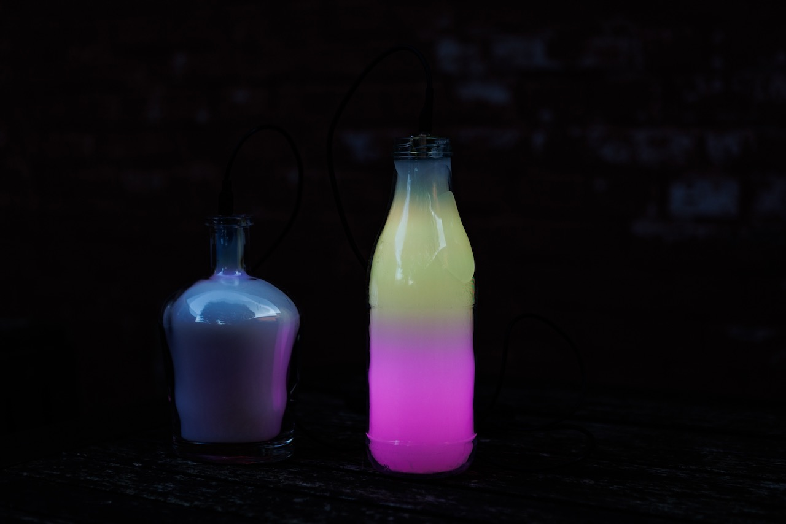
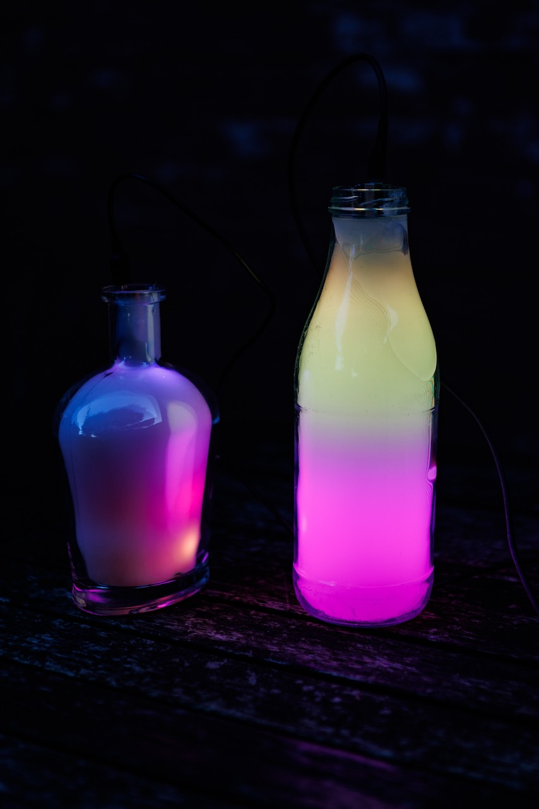
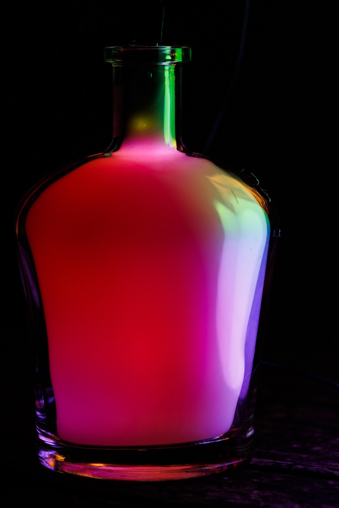
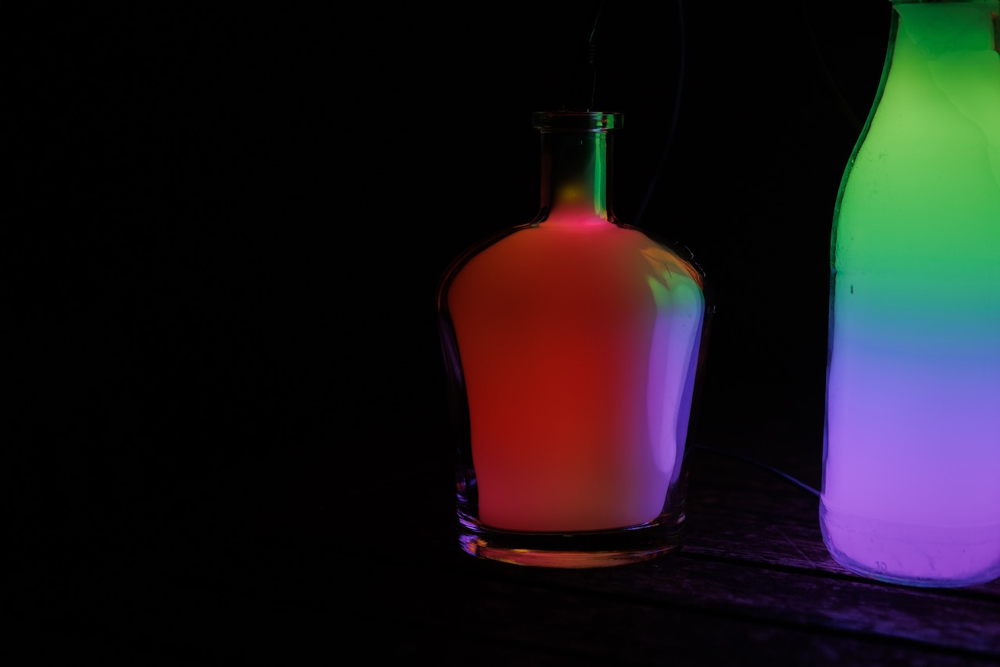

**Blinkenbottle** is a project based on an idea by [@phlmn] (https://github.com/orgs/flipdot/people/phlmn) & [@rbnis] (https://github.com/orgs/flipdot/people/rbnis).
The original project was realised on an Arduino, with Fast-LED. 
I took the idea and implemented it on an ESP 8266, with MicroPython. Big κῦδος goes to [@malled] (https://github.com/malled2002) for all the support and tips whenever I had knots in my brain! Thank you!

**_Instructions for rebuilding, you need:_**

* Grab a bottle you like (empty would be good too).
* 1x WS2812B strip (preferably with 60 LEDs per metre or denser)
* 1x round rod (or similar), as long as the bottle is high on the inside
* 1x ESP 8266, ESP32, RaspberryPi Pico. Or something else with which you can control the LED and on which MicroPython runs.
* and of course a diffuser that you tip into the bottle, I experimented with hot glue, paraffin and silicone.
  
Glue the LED strip to the round rod from three sides (pay attention to the directional arrow), preferably down , up, down. Leave space at the top of the rod for the microcontroller, which you can then attach to it (small cable ties work best). Now get down to the silly soldering work.
After that, sink the whole thing into the bottle with the diffuser. If it's hard by now, you've done something wrong in terms of timing, so hurry up next time!
Adapt the code to your microcontroller and the length of the LED, improve the code and send it to me by all means!
Otherwise, hook this thing up to power, crack open a drink, sit back and enjoy the show!

_Plans for the next version:_
Put a cap on the bottle that integrates the USB port.
Connect a potentiometer (and of course adjust the code accordingly, otherwise nothing will change) to adjust the brightness.
Find other materials for the bottle to be able to save the diffuser if necessary.

_Bugs to hunt:_
whenever the colour changes to red, it jerks and I still have no idea why
